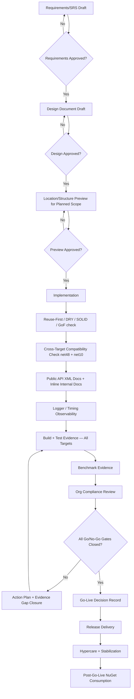

# SDLC Policy — Invitrek-swt

**Applies to:** All repositories  
**Mandatory:** No code, no design, no implementation without following this workflow.

---

## Complete Workflow

```
Phase 1: Requirements  →  Phase 2: Design  →  Phase 3: Implementation
    →  Phase 4: Post-Implementation Reports  →  Phase 5: Documentation
    →  Phase 6: Final Sign-Off
```

### Phase 1: Requirements (FIRST — MANDATORY)
1. Create Requirements/SRS document (template: `templates/REQUIREMENTS_SRS_TEMPLATE.md`)
2. Requirements review and approval
3. Requirements baseline

### Phase 2: Design (after requirements approval)
4. Create Design document (template: `templates/DESIGN_DOCUMENT_TEMPLATE.md`)
5. Design review and approval
6. Design baseline

For planned scope additions, a **location/structure preview** must be approved before adding any new projects, contracts, or code.

### Phase 3: Implementation (after design approval)
7. Implement feature following approved design
8. Code review against design
9. Unit testing (>90% coverage target)

### Phase 4: Post-Implementation Reports (MANDATORY)
10. Quality Report
11. Compatibility Report
12. Test Report
13. Performance/Benchmark Report
14. Improvements Report

### Phase 5: Documentation
15. Update public documentation
16. Update private/internal documentation

### Phase 6: Final Sign-Off
17. Verification against requirements
18. Final approval
19. Release

---

## Enforcement Rules

**Forbidden:**
- Writing code without approved requirements AND approved design
- Creating design without approved requirements
- Skipping post-implementation reports
- Proceeding to next phase without sign-off

**Required:**
- Create comprehensive requirements document first
- Get requirements approved before design work begins
- Get design approved before implementation begins
- Complete all post-implementation reports before release

---

## Delivery Workflow (Mermaid)



---

## Document Templates

| Phase | Template |
|-------|----------|
| Requirements | `templates/REQUIREMENTS_SRS_TEMPLATE.md` |
| Design | `templates/DESIGN_DOCUMENT_TEMPLATE.md` |
| Quality Report | `templates/QUALITY_REPORT_TEMPLATE.md` |
| Compatibility Report | `templates/COMPATIBILITY_REPORT_TEMPLATE.md` |
| Test Report | `templates/TEST_REPORT_TEMPLATE.md` |
| Performance Report | `templates/PERFORMANCE_REPORT_TEMPLATE.md` |
| Improvements Report | `templates/IMPROVEMENTS_REPORT_TEMPLATE.md` |

---

## Gate Reference

| Gate | Artifact | Exit Criteria |
|------|----------|---------------|
| Requirements | Approved SRS | Signed-off by Product + Architect |
| Design | Approved Design | Signed-off by Lead Architect + CTO |
| Planned Scope Preview | Location/structure approval | Approved before any additions |
| Quality/Compatibility | Design standards + cross-target safety | All targets build clean |
| Test | Consolidated test report | >90% unit, >80% integration, 100% critical path |
| Benchmark | Reproducible benchmark evidence | Meets target SLAs |
| Compliance | Org checklist | All items checked, no release blockers |
| Final Go/No-Go | Signed release decision | All No-Go gates closed |
